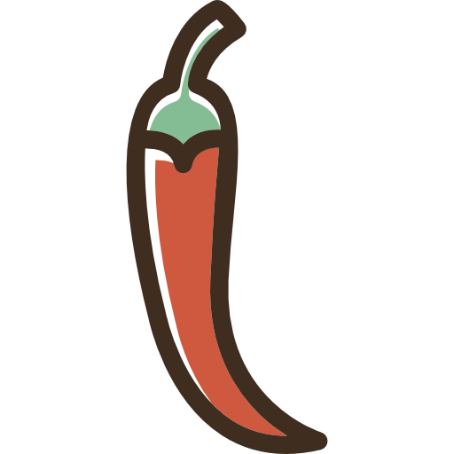
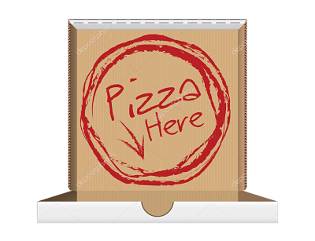

<!DOCTYPE html>
<html lang="en">

<head>
  <meta charset="UTF-8">
  <meta name="viewport" content="width=device-width, initial-scale=1.0">
  <meta http-equiv="X-UA-Compatible" content="ie=edge">
  
  <link rel="stylesheet" href="style/ingredients-pizza.css">
  <link rel="stylesheet" href="style/start-page.css">
  <link rel="stylesheet" href="style/pizza.css">
  <title>Giorgio's Kitchen</title>
</head>
<body>
    <audio volume="0.5" src="audios/Musica Tradicional.mp3"
    autoplay></audio>
  

    

      
 COMPLIMENTI! 

      
Gracias por jugar, ahora comeremos pizza

      
Gracias a Ruben Armendiz y Maria Alonso por su tiempo

      
A Giorgio por su cara y su voz

      
Gracias a todos

    

    
    

      
    

    

      
    

    

      
      <ul>
        <li>Hay hambre, queremos pizza</li>
        <li>Mueve cada ingrediente a la caja</li>
        <li>No elijas los que no son  o Giorgio se enfadará</li>
        <li>Consigue bonificaciones</li>
        <li>Corre, tenemos hambre</li>
      </ul>
    

    
Ganancias: 

    

      <h2>Today's Pizza</h2>
      <h3>Carne</h3>
      
      
      
      
      
      
      
    

    

      <h2>Today's Pizza</h2>
      <h3>Pepperoni Pizza</h3>
      
      
      
      
      
    

    

      <h2>Today's Pizza</h2>
      <h3>Boletus Pizza</h3>
      
      
      
      
      
      
    

    

      <h2>Today's Pizza</h2>
      <h3>Tuna Pizza</h3>
      
      
      
      
    

    

      <h2>Today's Pizza</h2>
      <h3>Diabola Pizza</h3>
      
      
      
      
      
    

      

        

        

        

      

        
        
        
        
        
        
        
        
        
        
        
        
      

      

      

  
  
  
</body>
</html>